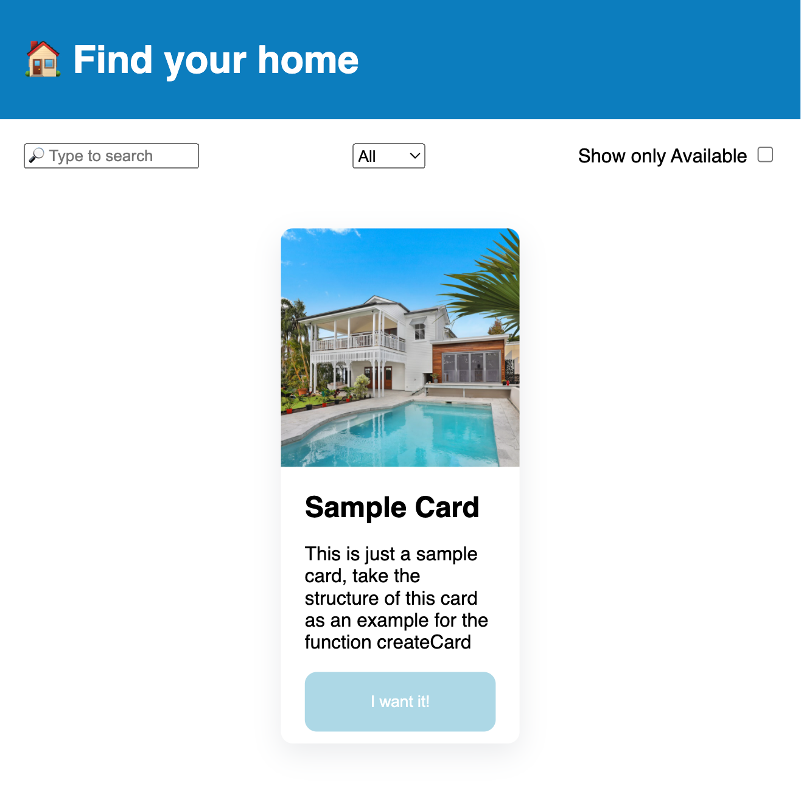

<h1 align="center">Bienvenue sur findYourHome 👋</h1>

  

# Exercice

## But de l'exercice 🎯

Le but de l'exercice est de manipuler le DOM avec tous les éléments disponible à votre disposition.

### Étape 1️

Récupérer la carte disponible dans l'exemple et faire une boucle sur les maisons qui se trouve dans le fichier `houseToRent.js`

### Étape 2️

Une fois cette chose faite, il faut **filtrer** avec toutes les méthodes qui sont disponible en JS !

## Bonus 🚀

Si vous avez des idées et des implémentation supplémentaire, n'hésitez pas à vous amuser...

C'est comme ça qu'on apprend ! ❤️

## Auteur

👤 **Anthony Gorski**

-   𝕏 - (Twitter): [@Gorski_Anthony](https://twitter.com/Gorski_Anthony)
-   GitHub: [@GorskiAnthony](https://github.com/GorskiAnthony)

## Affichez votre soutien

## Donnez un ⭐️ si ce projet vous a aidé !

### 🗃️ Version

-   **v** - First commit

---

### 👋 Qui suis-je ?

Je suis **Anthony Gorski**, développeur web et formateur à la [Wild Code School](https://www.wildcodeschool.com/fr-FR).
